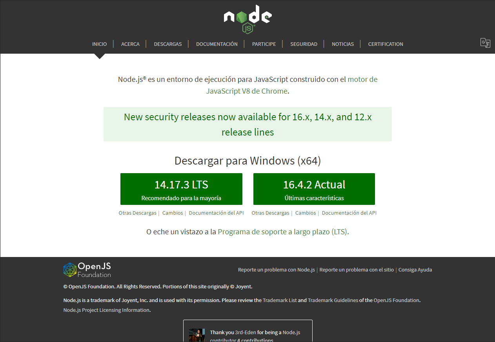
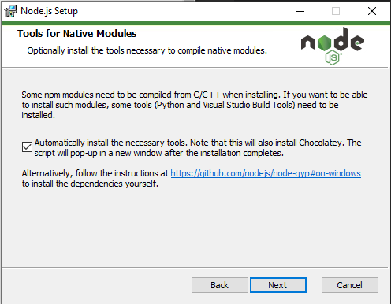
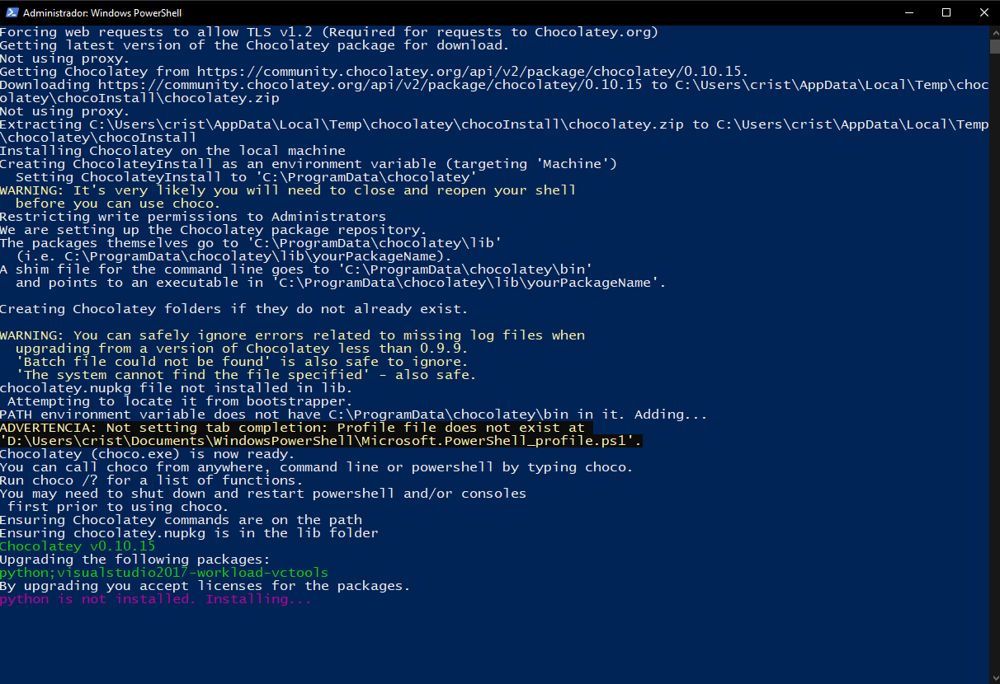
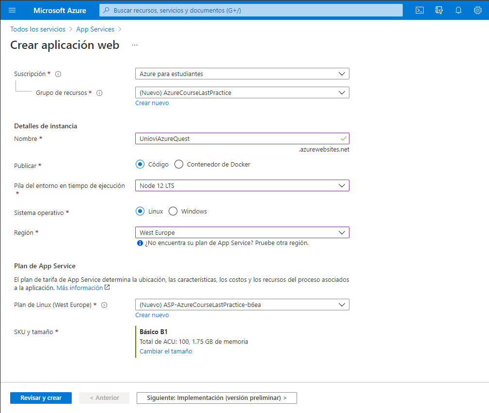
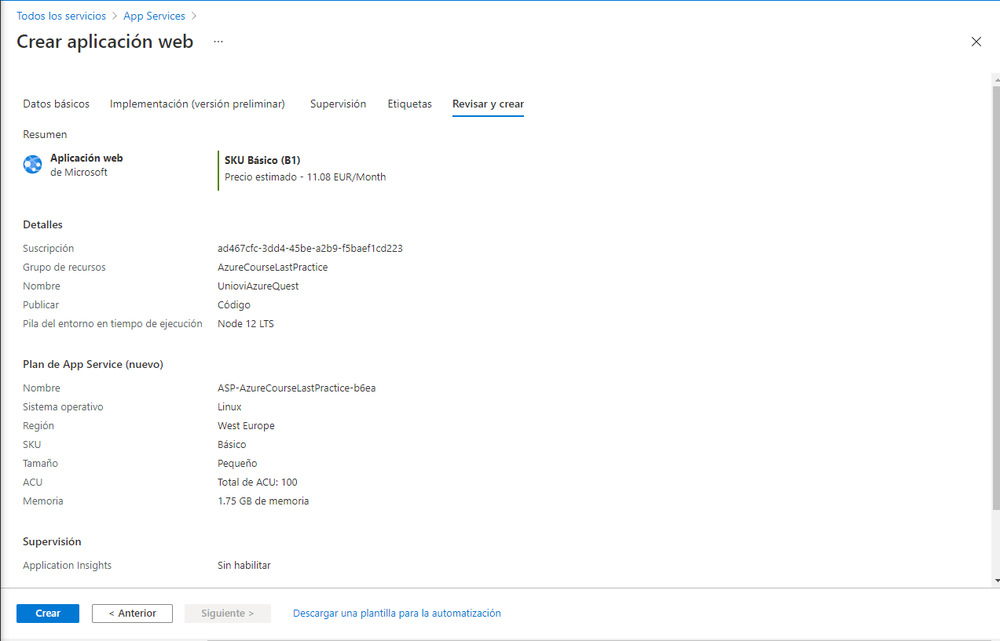
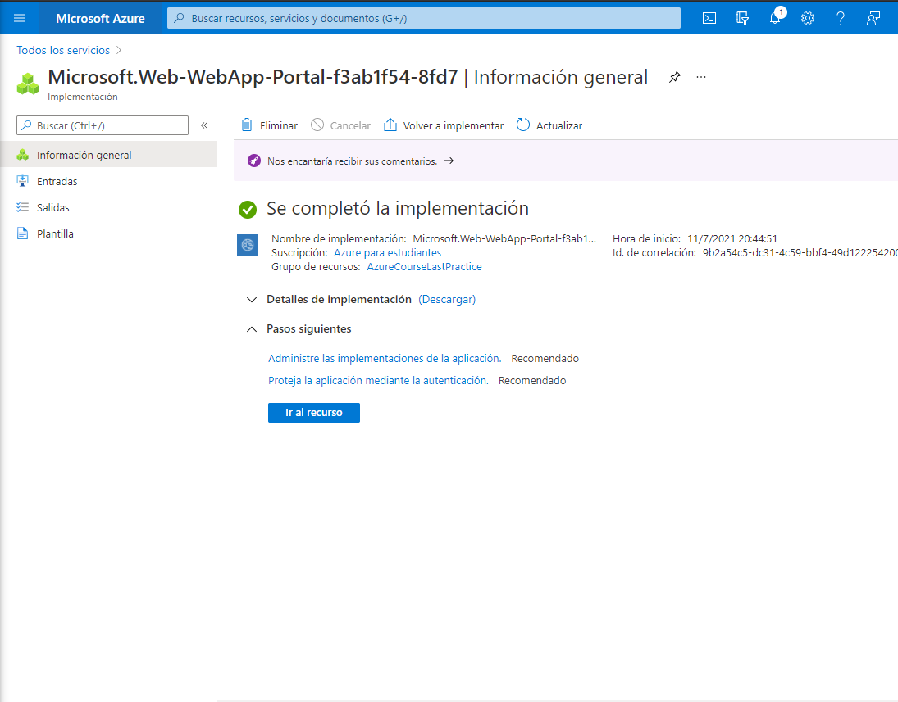
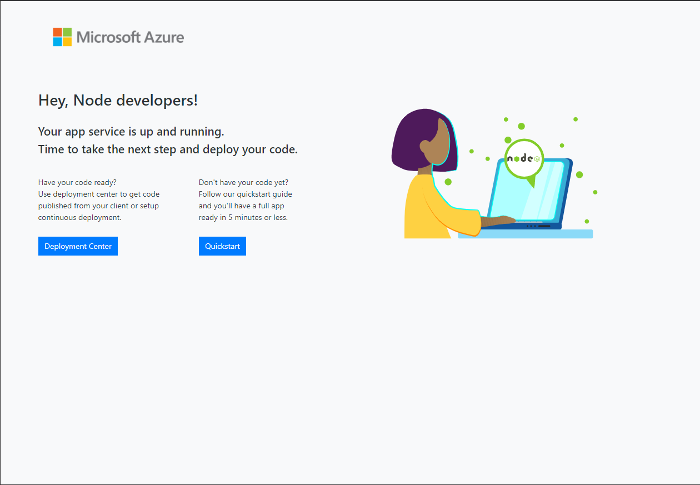
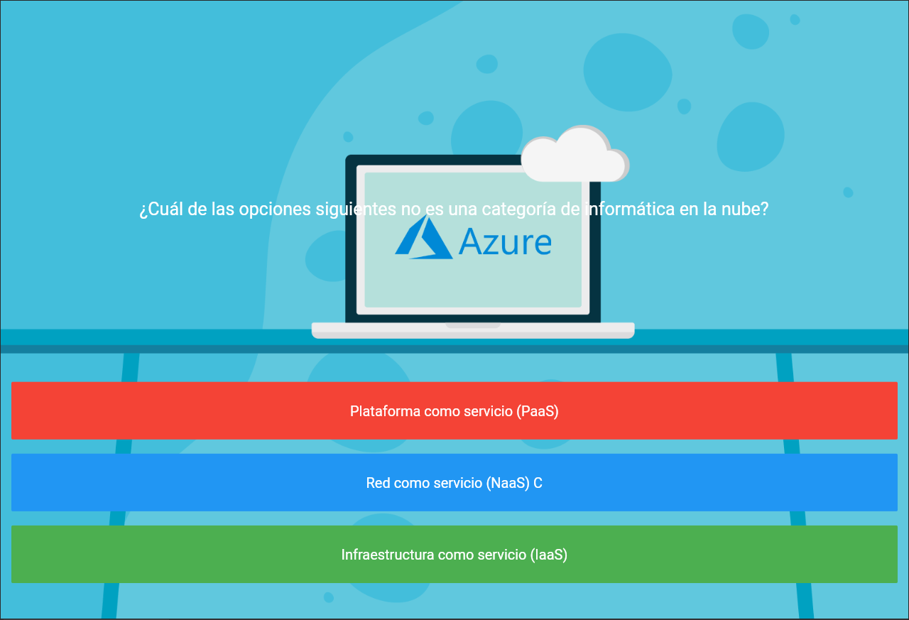
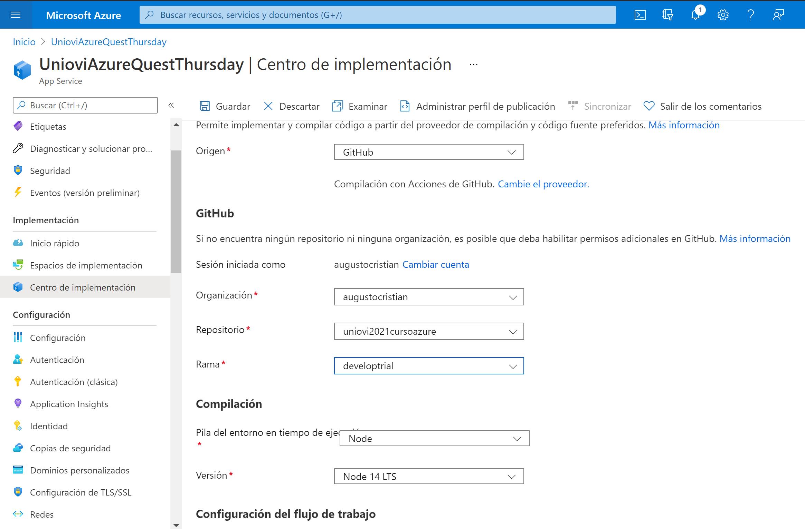
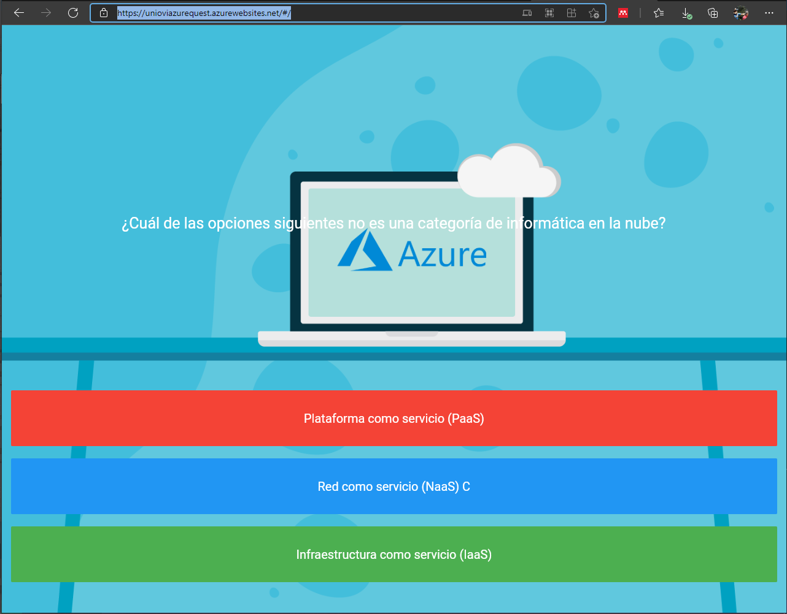

# Despliegue de una aplicación multiplataforma (Flutter) en el Cloud

Esta aplicación es un pequeño demostrador para desplegar en el Curso de Verano de MSAzure, esta basada en uno de los ejemplos del curso "The Complete Flutter Development Bootcamp with Dart" el.

## Requisitos Iniciales:
Dependiendo del sistema operativo se requiere de lo siguiente para poder desplegarlo en local:
### Usuarios con Windows
* Tener instalado Powershell V5 (Incluido en W10 y superiores)
* Tener instalado Git para Windows
 ```
 #Comprobarlo con:
git --version
 #Debe de devolver algo así: git version 2.23.0.xxx.xx  
 ```
* Tener instalado NodeJS 14 LTS
 ```
#Comprobarlo con:
node --version
 #Debe de devolver algo así: v14.17.3 
 ```
* Editor de texto a elección del usuario (VSCode,Sublime..)

### Usuarios con MacOs
* Tener instalado Git en la máquina
 ```
 #Comprobarlo con:
git --version
 #Debe de devolver algo algo así: git version 2.23.0.xxx.xx  
 ```
* Tener instalado NodeJS 14 LTS
 ```
#Comprobarlo con:
node --version
 #Debe de devolver algo así: v14.17.3 
 ```
* Editor de texto a elección del usuario (Joe,Sublime..)

### Usuarios con Linux
* Tener instalado Git en la máquina
 ```
 #Comprobarlo con:
git --version
 #Debe de devolver algo tal que git version 2.23.0.xxx.xx  
 ```
* Tener instalado NodeJS 14 LTS
 ```
#Comprobarlo con:
node --version
#Debe de devolver algo así: v14.17.3 
 ```
* Editor de texto a elección del usuario (VIM,Sublime..)

### Procedimiento
1. En primer lugar debemos de instalar Flutter: https://flutter.dev/docs/get-started/install
2. Debemos de crear en la raiz de nuestro disco duro una carpeta llamada src  ej: C:\src\ en la que descomprimiremos (o clonaremos) el repositorio. Una vez hecho esto debemos de incluir en el path la carpeta \bin donde encontraremos los diferentes binarios:
#### Usuarios Windows:
 ```
C:\src>git clone https://github.com/flutter/flutter.git -b stable
 ```
Añadir la variable de entorno al path: https://answers.microsoft.com/en-us/windows/forum/all/adding-path-variable/97300613-20cb-4d85-8d0e-cc9d3549ba23

#### Usuarios MacOs:
 ```
 cd ~/development
 unzip ~/Downloads/flutter_macos_2.2.3-stable.zip
 export PATH="$PATH:`pwd`/flutter/bin"
  ```

3. Ejecutamos la herramienta de diagnóstico de Flutter:
 ```
flutter doctor
 ```
4. Una vez la herramienta de diagnóstico no nos reporte más errores podemos proceder con los siguientes pasos.
5. Vamos a proceder a instalar NodeJS, para ello nos dirigimos a la [Página Oficial](https://nodejs.org/es/) y nos descargamos la versión 14.17.3 LTS.

<p align="center">
  
</p>

6. Hacemos la instalación por defecto, seleccionando que se nos instalen también las dependencias necesarias para compilar otras librerías:

<p align="center">
  
</p>

(Se nos abrirá una consola de Powershell donde veremos el progreso de la instalación).

<p align="center">
  
</p>

7. Una vez tengamos NodeJS instalado estaremos listos para pasar a preparar el repositorio.

## Preparación del repositorio
Aunque Flutter nos permite desarrollar para tres plataformas (web, Android e IOS) a la vez, en esta práctica lo que se hará será desplegar la versión web para crear una aplicación web en el servicio Azure App Service. Hacer los siguientes pasos:
1. Acceder con nuestra cuenta de GitHub al  repositorio: https://github.com/augustocristian/uniovi2021cursoazure
2. Crear una ramificación (Fork) del mismo, esto realiza una copia del código actual en un nuevo repositorio propio de la aplicación de ejemplo que usaremos.
3. Clonamos este repositorio con:
 ``` 
 git clone https://github.com/{USERGITHUB}}/uniovi2021cursoazure 
 ```
4. Nos ubicamos en el directorio que se ha clonado:
``` 
cd uniovi2021cursoazure/
 ```
5. ¡Ya estamos listos para comenzar!

## Compilar el proyecto Dart como aplicación web.
Antes de nada, creamos una nueva rama de desarrollo y nos cambiamos a ella:
  ```
  git branch develop{nalumno}
  git checkout develop{nalumno}
  ```
Una vez hecho esto, ya podríamos compilar el proyecto,  para ello primero creamos todos los directorios necesarios con el comando:
  ```
  flutter create .
  ```
  Esto es necesesario porque la aplicación que tenemos en el repositorio se creo antes de que Flutter soportase las aplicaciones web en la rama establ. Una vez creados los directorios necesarios, se construye la solución con:
  ```
  flutter build web
  ```

 ## Creación de una aplicación web empleando Azure Portal.
Para crear y desplegar una aplicación web en el Cloud de Microsoft existen varias alternativas (ej. una MV o un container) pero en esta práctica vamos a emplear el servicio de Aplicaciones de Azure. Para ello:
1. Accede a Azure Portal e identifícate con tu cuenta de estudiante.
_Acceso al portal [Portal](https://portal.azure.com/#home)_
2. En el portal, navega hasta "Todos los Servicios" y selecciona en el panel izquierdo "Web".
3. Para agilizar, en el cuadro de búsqueda busca App... hasta que le salga App Services (este será el servicio a utilizar).
4. Pulse Crear App Service.
5. Rellene los siguientes campos:
  * Suscripción: Azure para estudiantes (Dejar como esta)
  * Grupo de recursos: Creamos uno y lo llamamos AzureCourseLastPractice.
  * Nombre de la app: UnioviAzureQuest{NombreAlumno}
  * Publicar: Código, lo que conseguiremos con esto es publicar el código para que otro servicio lo utilice (lo que comunmente se denomina stack). Para ello tendremos que configurar la pila de ejecución de App Service para que despliegue la app.
  * Runtime stack : Node 14 LTS, se trata del servidor web/plataforma que  desplegará  la aplicación. Node 12 LTS también debería funcionar.
  * Sistema operativo: Especifica el sistema operativo que empleará por debajo el stack, en nuestro caso Linux
  * Región: Seleccionaremos la más cercana (West Europe). 
  * Plan de Linux: Seleccionamos  ASP-AzureCourseLastPractice-bxxxx 
  * SKU y tamaño: Seleccionamos una instancia B1, que nos costará al mes 11.08€, esta instancia tiene  1.75 GB de memoria (más que suficiente para lo que necesitamos)

<p align="center">
  
</p>

6. Pulsamos Revisar y Crear. Volvemos a pulsar crear, se nos quedará Validando en unos segundos.

<p align="center">
  
</p>

7. Apretamos en ir al recurso, veremos como se abre la ventana de monitorización de la app. Vamos a ver la página "Hola mundo" que Microsoft precarga pulsando en la URL:

<p align="center">
  
</p>

Aspecto de la página por defecto:
<p align="center">
  
</p>

## Preparar el servidor NodeJS para desplegar nuestra aplicación con Flutter.
Vamos a preparar el servidor NodeJS para poder desplegar nuestra aplicación desarrollada con Flutter. Para ello realizamos los siguientes pasos.

1. Comprobamos que nos encontramos en la raiz del repositorio.

2. Instalamos la utilidad application generator tool (express-generator) que nos permitirá crear una aplicación por defecto rápidamente con:

  ```
  npm install -g express-generator
  ```

3. Creamos los ficheros necesarios para el servidor con:
  ```
  express
  ```

4. Modificar app.js para que apunte al directorio donde se compila la aplicación web, esto lo hacemos cambiando la linea:

  ```
  app.use(cookieParser());
  // app.use(express.static(path.join(__dirname, 'public')));
  app.use(express.static(path.join(__dirname+'/build', 'web')));
  ```

Este cambio lo que hace es buscar en la ruta seleccionada (sube en el árbol de directorios, accede a la carpeta /build y busca la carpeta web) para desplegar la página que ahí se encuentre.
  
5. Ejecuta los siguientes comandos y accede tras ello a localhost:3000:
  
  ```
  npm install 
  SET DEBUG=nodejsroot:* & npm start
  ```

6. Deberemos de poder ver nuestra aplicación de forma correcta:

<p align="center">
  
</p>

  Sube los cambios realizados al repositorio

7. Ahora vamos a desplegar el servidor NodeJS que se ha creado en AppServices.Azure permite integraciones con una gran cantidad de fuentes, por lo que automatizar el despliegue de una aplicación en un repositorio no debería de ser un problema. Nos dirigimos Azure App Service y seleccionamos Centro de Implementación. Dentro de el en Origen seleccionamos GitHub(esto permitirá acceder directamente al código del repositorio).

8. Seleccionamos lo siguiente:
  * Origen: GitHub y pulsamos autorizar, nos pedirá las credenciales
  * Organización: {nombreusuario}
  * Repositorio : uniovi2021cursoazure
  * Rama: develop{nalumno}
  * Pila de entorno: Node
  * Versión Node: 14 LTS
  Pulsamos Finalizar

<p align="center">
  
</p>

9. Nos dirigimos a la URL donde tenemos nuestro recurso de Azure y ¡Voila!

<p align="center">
  
</p>

10. Ahora vamos a comprobar el "Despliegue continuo", para ello vamos a modificar algún detalle y subirlo al repositorio, por ejemplo el fondo de la aplicación (ubicado en el directorio /images con el nombre "background.png"). 

11. Debemos de volver a compilar la página web, para ello ejecutamos una vez más:

  ```
  flutter build web
  ```

12. Hacemos push y comprobamos que se actualice (puede tardar varios minutos en ocasiones.

<p align="center">
  
</p>

## Extra
1. Añade algunas "preguntas" a la aplicación de cuestionarios que se proporciona como ejemplo.

2. Despliega algún proyecto personal/académico empleando las tecnologías que has visto en el curso.


